[TOC]

# 1.项目架构

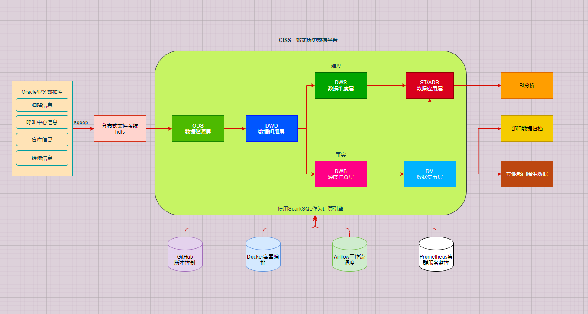

**因为虚拟机资源有限，所以并没有加入Jenkins，因为是部署在Docker上没有部署在K8s上，所以Jenkins也没什么必要，项目是可以部署在K8s上，但是没什么时间去研究，所以就寻求方便，直接部署在Docker上**

# 2.开发工具

| 工具                  | 版本     | 用途                               |
| --------------------- | -------- | ---------------------------------- |
| PyCharm(Professional) | 2021.3.3 | 项目代码编写管理                   |
| DBeaver Enterprise    | 21.3.0   | 数据库可视化, 支持Redis, MongoDB等 |
| VMware 16 Pro         | 16.1.0   | 创建虚拟机服务器                   |
| MobaXterm             | 22.1     | 虚拟机可视化终端                   |

在项目开发过程中除了Pycharm外还有一些比较好的开发编辑工具，比如Zeppelin，Scriptis 比较推荐的是这两款，在线写SQL，Pyspark，Scala等

# 3.项目环境测试

本项目组件都采用Docker部署,如果经济允许,可以部署在比如ACK集群、GKE集群等云服务器上

如何在Docker上部署这些组件文档已更新:Spark-OneStop-DataPlatform\项目组件镜像制作

## **6.1 Oracle**

```shell
启动/关闭:
docker start/stop oracle
进入:
docker exec -it oracle bash
连接:
#进入客户端命令行：/nolog表示只打开，不登录，不用输入用户名和密码
sqlplus /nolog
#登陆连接服务端：/ as sysdba表示使用系统用户登录
conn / as sysdba
测试:
select TABLE_NAME from all_tables where TABLE_NAME LIKE 'CISS_%';
```

客户端工具连接:

用户名:ciss

密码:123456

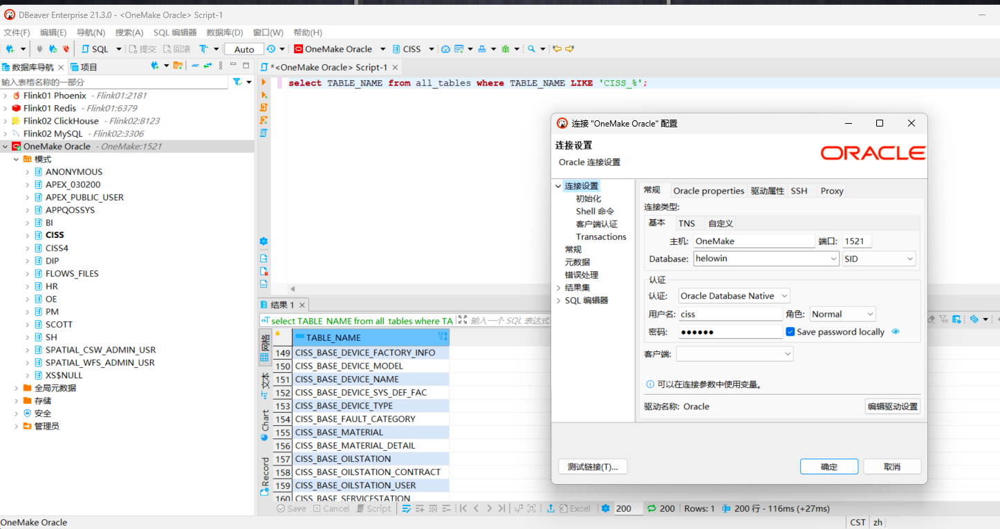

## **6.2 MySQL**

MySQL没有使用Docker容器部署，直接部署在当前OneMake宿主机器上，默认开启自启动

使用客户端工具连接:

用户名：root

密码：123456

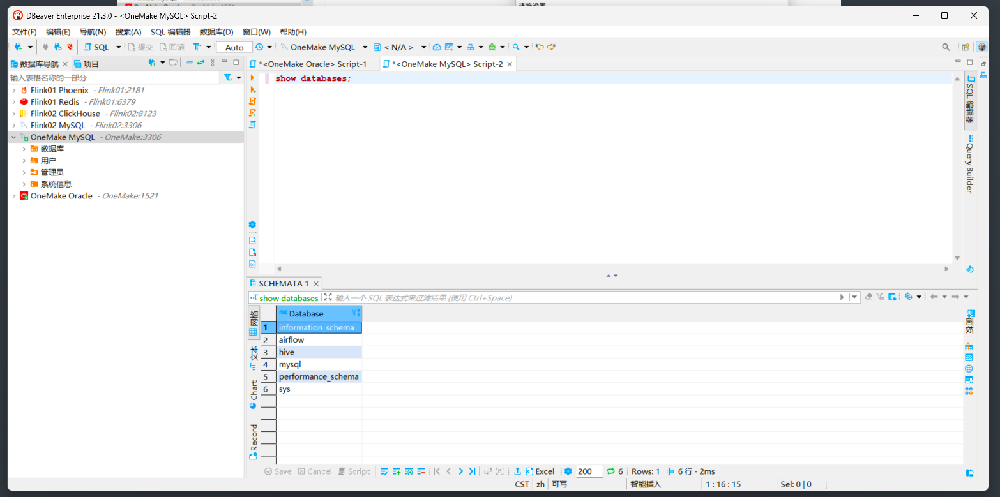

## **6.3 Hadoop**

```shell
启动/关闭:
docker start/stop hadoop
进入:
docker exec -it hadoop bash
默认是启动HDFS、Yarn、Jobhistory的
```

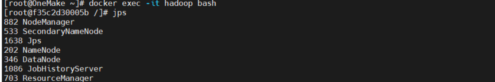

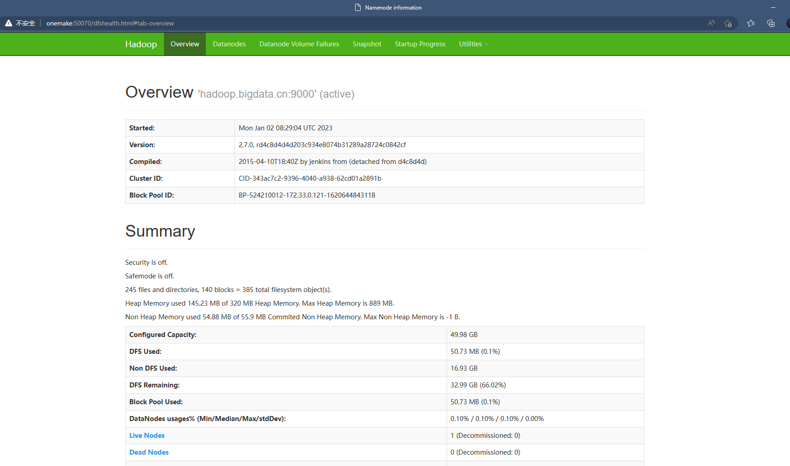

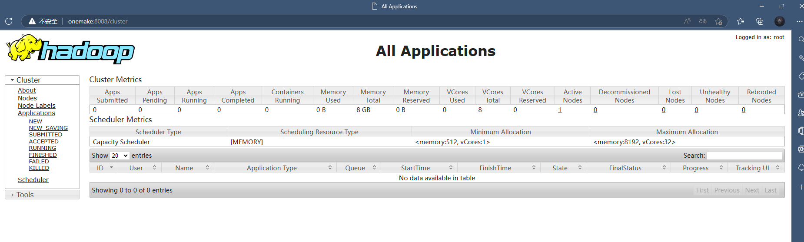

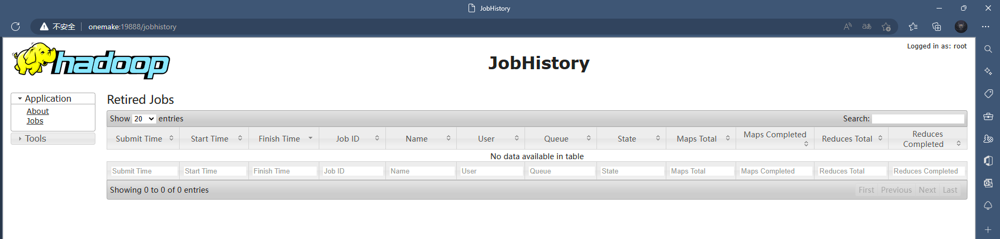

## **6.4 Hive**

```shell
启动/关闭:
docker start/stop hive
进入:
docker exec -it hive bash
连接:
beeline
!connect jdbc:hive2://hive.bigdata.cn:10000
```

客户端工具连接:

用户名：root

密码：123456

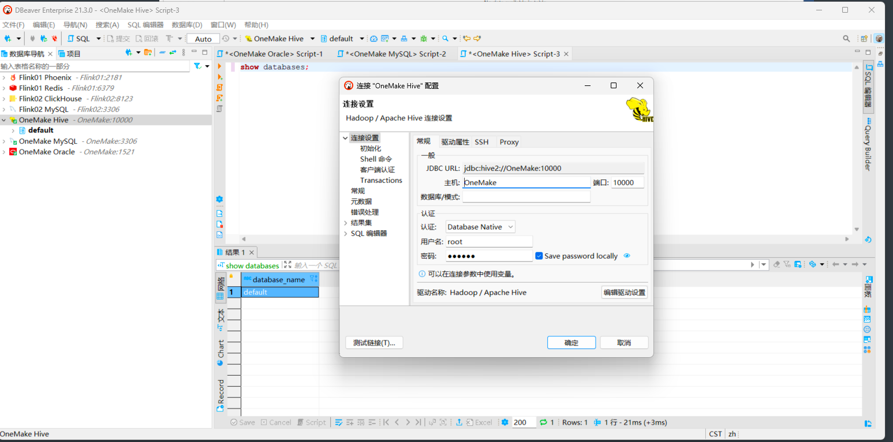

## **6.5 Spark**

```shell
启动/关闭:
docker start/stop spark
进入:
docker exec -it spark bash
启动ThriftServer(默认已经启动了的):
start-thriftserver.sh \
--name sparksql-thrift-server \
--master yarn \
--deploy-mode client \
--driver-memory 1g \
--hiveconf hive.server2.thrift.http.port=10001 \
--num-executors 3 \
--executor-memory 1g \
--conf spark.sql.shuffle.partitions=2
连接:
beeline -u jdbc:hive2://spark.bigdata.cn:10001 -n root -p 123456
```

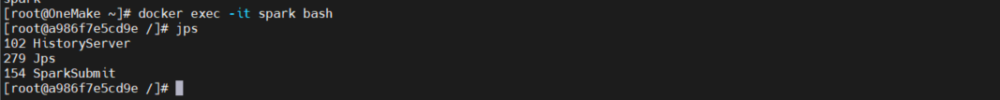

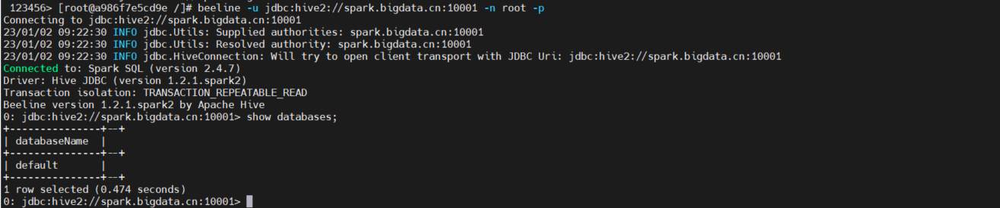

## **6.6 Sqoop**

```shell
启动/关闭:
docker start/stop sqoop
进入:
docker exec -it sqoop bash
测试:
sqoop list-databases \
--connect jdbc:oracle:thin:@oracle.bigdata.cn:1521:helowin \
--username ciss \
--password 123456
```

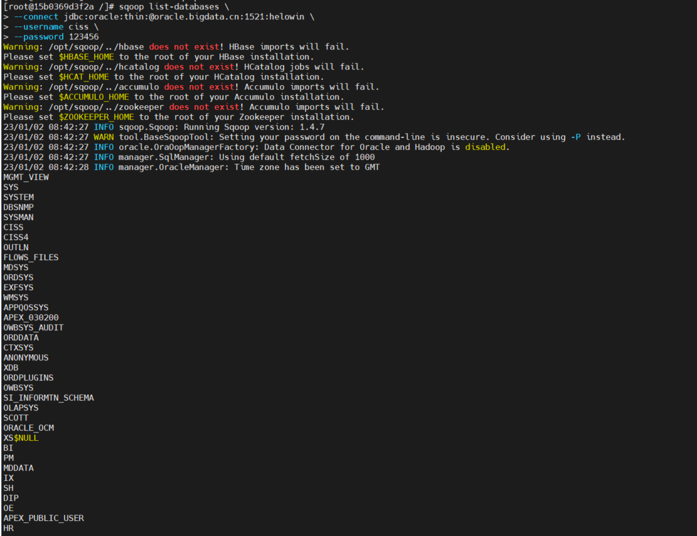