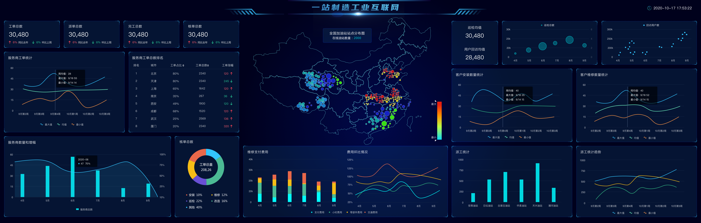

[TOC]


# 1.业务流程


```markdown
step1：加油站服务商联系呼叫中心，申请服务：安装/巡检/维修/改造加油机
step2：呼叫中心联系对应服务站点，分派工单：联系站点主管，站点主管分配服务人员
step3：服务人员确认工单和加油站点信息
step4：服务人员在指定日期到达加油站，进行设备检修
step5：如果为安装或者巡检服务，安装或者巡检成功，则服务完成
step6：如果为维修或者改造服务，需要向服务站点申请物料，物料到达，实施结束，则服务完成
step7：服务完成，与加油站站点服务商确认服务结束，完成订单核验
step8：工程师报销过程中产生的费用
step9：呼叫中心会定期对该工单中的工程师的服务做回访
```

# 2.业务指标

```
- 运营分析：呼叫中心服务单数、设备工单数、参与服务工程师个数、零部件消耗与供应指标等
- 设备分析：设备油量监控、设备运行状态监控、安装个数、巡检次数、维修次数、改造次数
- 呼叫中心：呼叫次数、工单总数、派单总数、完工总数、核单次数
- 员工分析：人员个数、接单次数、评价次数、出差次数
- 报销统计分析、仓库物料管理分析、用户分析
```

## 2.1报表



# 2.项目架构


# 4.开发工具

| 工具                  | 版本     | 用途                               |
| --------------------- | -------- | ---------------------------------- |
| PyCharm(Professional) | 2021.3.3 | 项目代码编写管理                   |
| DBeaver Enterprise    | 21.3.0   | 数据库可视化, 支持Redis, MongoDB等 |
| VMware 16 Pro         | 16.1.0   | 创建虚拟机服务器                   |
| MobaXterm             | 22.1     | 虚拟机可视化终端                   |