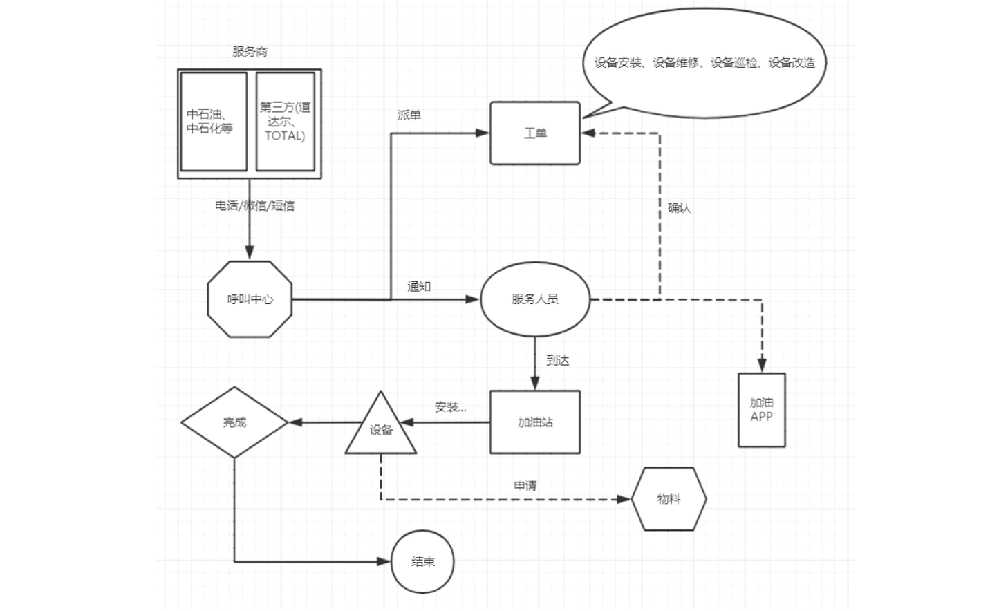

[TOC]


# 1.业务流程



```markdown
step1：加油站服务商联系呼叫中心，申请服务：安装/巡检/维修/改造加油机
step2：呼叫中心联系对应服务站点，分派工单：联系站点主管，站点主管分配服务人员
step3：服务人员确认工单和加油站点信息
step4：服务人员在指定日期到达加油站，进行设备检修
step5：如果为安装或者巡检服务，安装或者巡检成功，则服务完成
step6：如果为维修或者改造服务，需要向服务站点申请物料，物料到达，实施结束，则服务完成
step7：服务完成，与加油站站点服务商确认服务结束，完成订单核验
step8：工程师报销过程中产生的费用
step9：呼叫中心会定期对该工单中的工程师的服务做回访
```

# 2.业务指标

```
- 运营分析：呼叫中心服务单数、设备工单数、参与服务工程师个数、零部件消耗与供应指标等
- 设备分析：设备油量监控、设备运行状态监控、安装个数、巡检次数、维修次数、改造次数
- 呼叫中心：呼叫次数、工单总数、派单总数、完工总数、核单次数
- 员工分析：人员个数、接单次数、评价次数、出差次数
- 报销统计分析、仓库物料管理分析、用户分析
```

# 3.报表


# 4.项目架构


# 5.开发工具

| 工具                  | 版本     | 用途                               |
| --------------------- | -------- | ---------------------------------- |
| PyCharm(Professional) | 2021.3.3 | 项目代码编写管理                   |
| DBeaver Enterprise    | 21.3.0   | 数据库可视化, 支持Redis, MongoDB等 |
| VMware 16 Pro         | 16.1.0   | 创建虚拟机服务器                   |
| MobaXterm             | 22.1     | 虚拟机可视化终端                   |

# 6.项目环境测试

本项目组件都采用Docker部署,如果经济允许,可以部署在比如ACK集群、GKE集群等云服务器上

如何在Docker上部署这些组件文档已更新:Spark-OneStop-DataPlatform\项目组件镜像制作

## 6.1 Oracle

```shell
启动/关闭:
docker start/stop oracle
进入:
docker exec -it oracle bash
连接:
#进入客户端命令行：/nolog表示只打开，不登录，不用输入用户名和密码
sqlplus /nolog
#登陆连接服务端：/ as sysdba表示使用系统用户登录
conn / as sysdba
测试:
select TABLE_NAME from all_tables where TABLE_NAME LIKE 'CISS_%';
```

客户端工具连接:

用户名:ciss

密码:123456


## 6.2 MySQL

MySQL没有使用Docker容器部署，直接部署在当前OneMake宿主机器上，默认开启自启动

使用客户端工具连接:

用户名：root

密码：123456


## 6.3 Hadoop

```shell
启动/关闭:
docker start/stop hadoop
进入:
docker exec -it hadoop bash
默认是启动HDFS、Yarn、Jobhistory的
```


## 6.4 Hive

```shell
启动/关闭:
docker start/stop hive
进入:
docker exec -it hive bash
连接:
beeline
!connect jdbc:hive2://hive.bigdata.cn:10000
```

客户端工具连接:

用户名：root

密码：123456


## 6.5 Spark

```shell
启动/关闭:
docker start/stop spark
进入:
docker exec -it spark bash
启动ThriftServer(默认已经启动了的):
start-thriftserver.sh \
--name sparksql-thrift-server \
--master yarn \
--deploy-mode client \
--driver-memory 1g \
--hiveconf hive.server2.thrift.http.port=10001 \
--num-executors 3 \
--executor-memory 1g \
--conf spark.sql.shuffle.partitions=2
连接:
beeline -u jdbc:hive2://spark.bigdata.cn:10001 -n root -p 123456
```


## 6.6 Sqoop

```shell
启动/关闭:
docker start/stop sqoop
进入:
docker exec -it sqoop bash
测试:
sqoop list-databases \
--connect jdbc:oracle:thin:@oracle.bigdata.cn:1521:helowin \
--username ciss \
--password 123456
```

