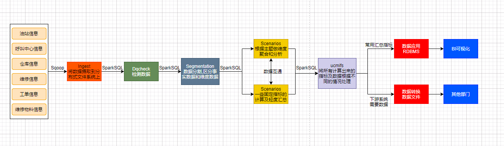

[TOC]


# 1.数据分层整体设计



## 1.1分层设计

```properties
Ingest:原始数据层，直接把sqoop的抽取过来的数据导入到数据平台上，通过SparkSQL建外表的形式导入到数据平台里
Dqcheck:数据质量检测，制定一些数值，检测部分重要的原始事务事实数据，其他的数据在后面Seg及Sce会进行过滤，并产出一些数据质量指标
Segmentation:对数据做分割，将事实数据和维度数据分到不同的表里便于后面计算
Scenarios:指标大部分在这里生成根据不同的主题做轻度聚合及维度聚合，将事实表的数据根据主题进行关联，将维度数据与事实数据关联聚合;一方面是生成大部分业务指标;             一方面是根据下游系统提出的需求计算出他们所需要的数据;数据应用比较多，业务比较复杂
Ucmifs:基于前面的计算结果，周期性的备份一些重要的数据，方便以后新的业务需求迭代开发;将下游系统需要的数据生成数据文件并送往下游系统服务器上;将一些常用的指标发        送到RDBMS，通过BI工具分析及展示
```

## 1.2分层数据

```mathematica
Ingest:
      数据内容:存储所有原始业务数据，基本与Oracle数据库中的业务数据(14个月的数据)保持一致(通过建外表形式导入数据)
      数据来源:使用Sqoop从Oracle中同步采集
      存储设计:Hive分区表，AVRO文件格式存储，保留8个月
Dqcheck:
      数据内容:导入数据平台的部分业务数据
      数据来源:Ingest里的数据
      存储设计:Hive分区表，ORC文件格式存储，保留所有的数据质量指标
Segmentation:
      数据内容:存储所有的业务数据的明细数据
      数据来源:对Ingest里的所有业务数据通过ETL扁平化并根据主题分割成事实数据和维度数据
      存储设计:Hive分区表，ORC文件格式存储，保留所有数据
Scenarios1:
      数据内容:存储所有事实与维度根据主题的基本关联及轻度汇总后的指标等数据
      数据来源:对Segmentation的数据进行清洗过滤、轻度聚合以后的数据
      存储设计:Hive分区表，ORC文件格式存储，保留所有数据
      特点：数量小、很少发生变化、全量采集
Scenarios2:
      数据内容:存储所有业务的维度数据：日期、地区、油站、呼叫中心、仓库等维度表
      数据来源:对Segmentation的数据根据主题做聚合分析及关联
      存储设计:Hive分区表，ORC文件格式存储，保留所有数据
      特点：数量大、经常发生变化、增量量采集
Ucmifs:
      数据内容:需要周期性备份的部分数据及计算出来的所有指标指标数据还有需要送往下游的数据
      数据来源:在Scenarios中计算的到的指标及根据需求分割好的数据
      存储设计:Hive分区表，ORC文件格式存储，指标数据保留12个月，下游数据保留6个月
      目的:做一个数据分割，什么数据该去到哪里
```

# 2.业务架构


数据来源:

**ERP**系统：企业资源管理系统，存储整个公司所有资源的信息

- 所有的工程师、物品、设备产品供应链、生产、销售、财务的信息都在ERP系统中

**CISS**系统：客户服务管理中心，存储所有用户、运营数据

- 工单信息、用户信息等

呼叫中心：负责实现所有客户的需求申请、调度、回访等

- 呼叫信息、分配信息、回访信息

# 3.核心表结构


使用客户端工具可以查看到核心数据表的Schema信息(总共200张表):

- 总数


- 表Schema信息


## 3.1增量表与全量表

增量表(57张)：

所有维度数据表

场景：不会经常发生变化的数据表，例如维度数据表等

数据表：组织机构信息、地区信息、服务商信息、数据字典等

路径:Spark-OneStop-DataPlatform\项目代码\OneMake\Data_Integration\shell\sqoop_script\incr_import_tables.txt

全量表(44张):

所有事务事实的数据表

场景：经常发生变化的数据表，例如业务数据、用户行为数据等

数据表：工单数据信息、呼叫中心信息、物料仓储信息、报销费用信息等

路径:Spark-OneStop-DataPlatform\项目代码\OneMake\Data_Integration\shell\sqoop_script\full_import_tables.txt