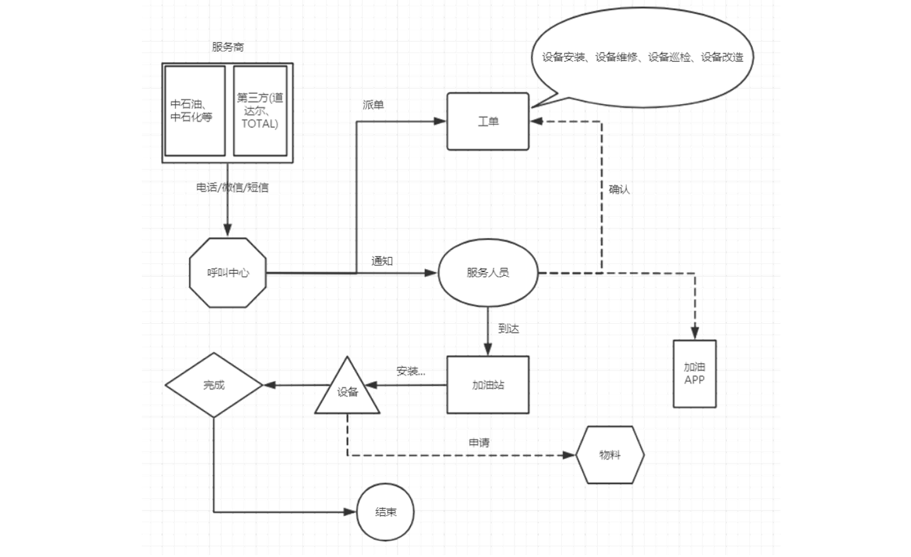
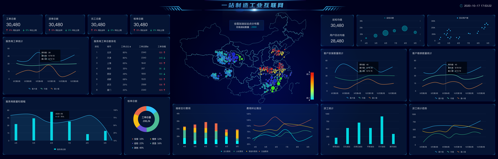
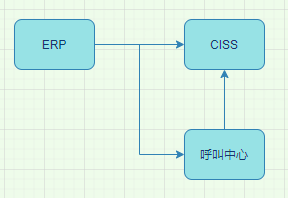
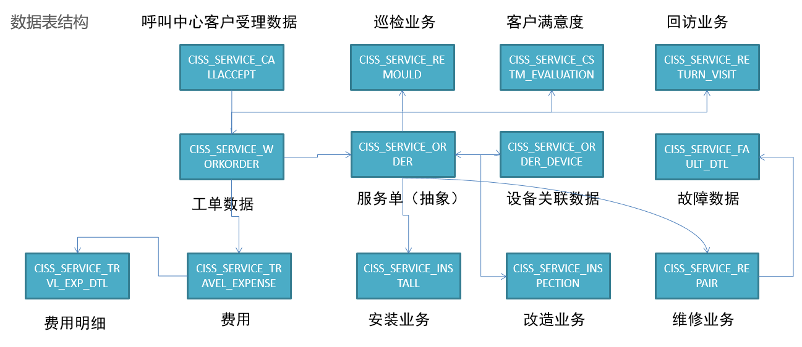
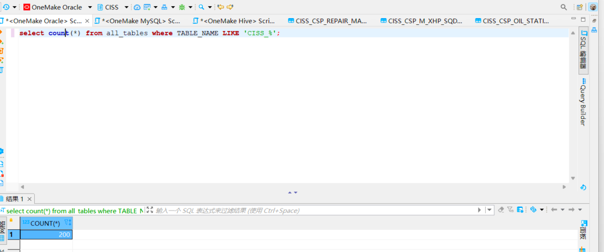
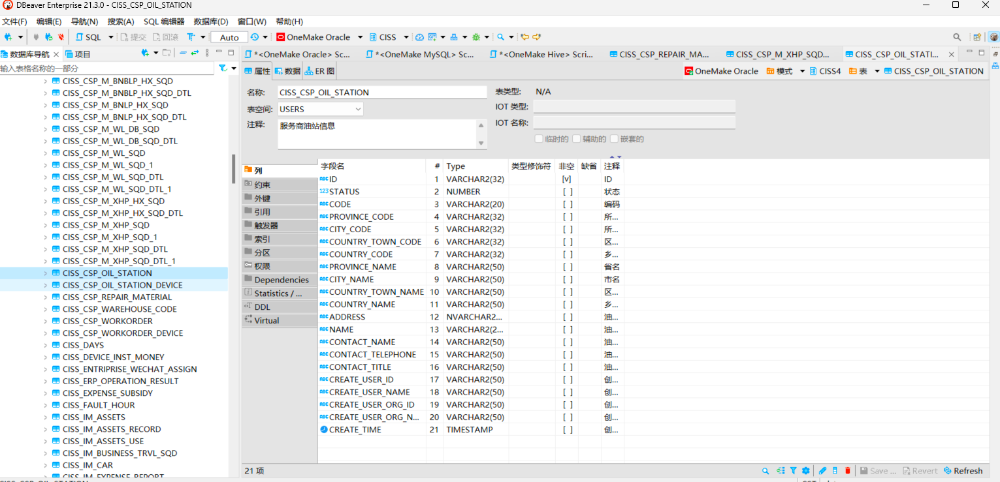

[TOC]


# 1.CISS业务流程



```mathematica
step1：加油站服务商联系呼叫中心，申请服务：安装/巡检/维修/改造加油机
step2：呼叫中心联系对应服务站点，分派工单：联系站点主管，站点主管分配服务人员
step3：服务人员确认工单和加油站点信息
step4：服务人员在指定日期到达加油站，进行设备检修
step5：如果为安装或者巡检服务，安装或者巡检成功，则服务完成
step6：如果为维修或者改造服务，需要向服务站点申请物料，物料到达，实施结束，则服务完成
step7：服务完成，与加油站站点服务商确认服务结束，完成订单核验
step8：工程师报销过程中产生的费用
step9：呼叫中心会定期对该工单中的工程师的服务做回访
```

# 2.CISS业务指标

```markdown
运营分析：呼叫中心服务单数、设备工单数、参与服务工程师个数、零部件消耗与供应指标等
设备分析：设备油量监控、设备运行状态监控、安装个数、巡检次数、维修次数、改造次数
呼叫中心：呼叫次数、工单总数、派单总数、完工总数、核单次数
员工分析：人员个数、接单次数、评价次数、出差次数
报销统计分析、仓库物料管理分析、用户分析
```

# 3.CISS报表



# 4.CISS系统数据分层整体设计


## **4.1分层设计**

```mathematica
ODS：原始数据层：最接近于原始数据的层次，直接采集写入层次：原始事务事实表
DWD：明细数据层：对ODS层的数据根据业务需求实现ETL以后的结果：ETL以后事务事实表
DWS：维度数据层：类似于以前讲解的DIM：存储维度数据表
DWB：基础数据层：轻度聚合，将主题事实的表进行关联，所有与这个主题相关的字段合并到一张表，基于主题的事务事实构建基础指标
ADS：数据应用层：存储每个主题基于维度分析聚合的结果：周期快照事实表，供数据分析的报表
DM：数据集市：按照不同部门的数据需求，将暂时没有实际主题需求的数据存储做部门数据归档，方便以后新的业务需求的迭代开发
```

## **4.2分层数据**

```mathematica
ODS:
数据内容：存储所有原始业务数据，基本与Oracle数据库中的业务数据保持一致
数据来源：使用Sqoop从Oracle中同步采集
存储设计：Hive分区表，avro文件格式存储，保留16个月
DWD:
数据内容：存储所有业务数据的明细数据
数据来源：对ODS层的数据进行ETL扁平化处理得到
存储设计：Hive分区表，orc文件格式存储，保留所有数据
DWS:
数据内容：存储所有业务的维度数据：日期、地区、油站、呼叫中心、仓库等维度表
数据来源：对DWD的明细数据中抽取维度数据
存储设计：Hive普通表，orc文件 + Snappy压缩
特点：数量小、很少发生变化、全量采集
DWB:
数据内容：存储所有事实与维度的基本关联、基本事实指标等数据
数据来源：对DWD层的数据进行清洗过滤、轻度聚合以后的数据
存储设计：Hive分区表，orc文件格式存储，保留所有数据
APP:
数据内容：存储所有报表分析的事实数据
数据来源：基于DWB和DWS层，通过对不同维度的统计聚合得到所有报表事实的指标
DM:
数据内容：存储不同部门所需要的不同主题的数据
数据来源：对DW层的数据进行聚合统计按照不同部门划分
```

# 5.CISS业务架构



数据来源:

**ERP**系统：企业资源管理系统，存储整个公司所有资源的信息

- 所有的工程师、物品、设备产品供应链、生产、销售、财务的信息都在ERP系统中

**CISS**系统：客户服务管理中心，存储所有用户、运营数据

- 工单信息、用户信息等

呼叫中心：负责实现所有客户的需求申请、调度、回访等

- 呼叫信息、分配信息、回访信息

# 6.CISS核心表结构



使用客户端工具可以查看到核心数据表的Schema信息(总共200张表):

- 总数



- 表Schema信息



## **6.1增量表与全量表**

增量表(57张)：

所有维度数据表

场景：不会经常发生变化的数据表，例如维度数据表等

数据表：组织机构信息、地区信息、服务商信息、数据字典等

路径:Spark-OneStop-DataPlatform\项目代码\OneMake\Data_Integration\shell\sqoop_script\incr_import_tables.txt

全量表(44张):

所有事务事实的数据表

场景：经常发生变化的数据表，例如业务数据、用户行为数据等

数据表：工单数据信息、呼叫中心信息、物料仓储信息、报销费用信息等

路径:Spark-OneStop-DataPlatform\项目代码\OneMake\Data_Integration\shell\sqoop_script\full_import_tables.txt