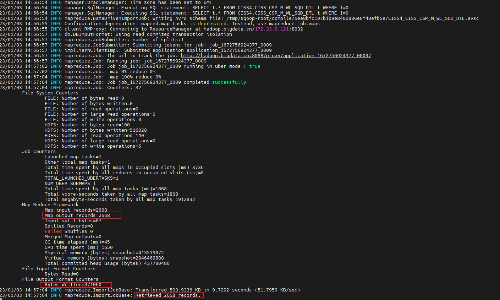
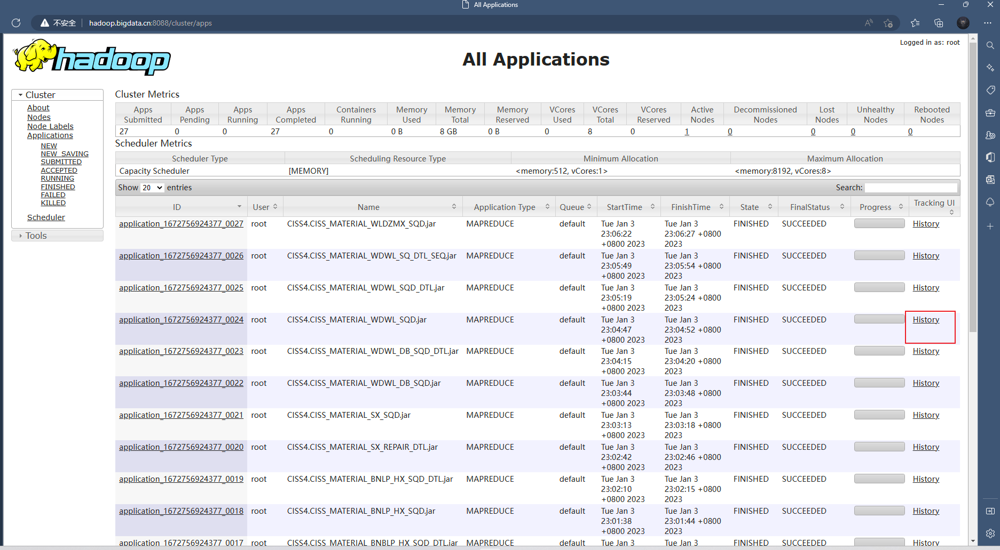
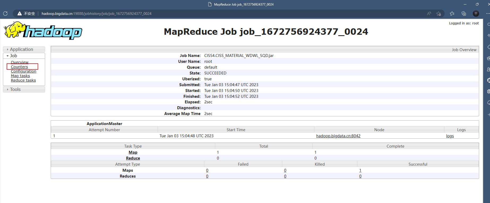
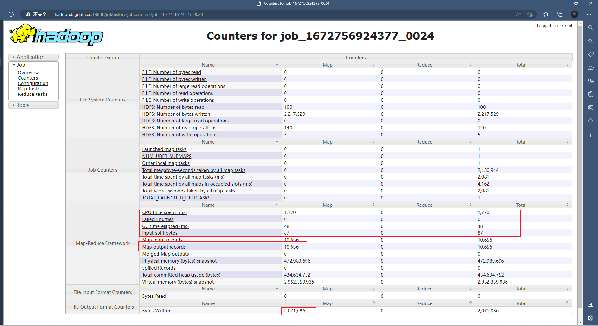

[TOC]


# 数据集成(采集)

# 1.Oracle_To_HDFS

将数据从Oracle抽取到HDFS采用的是Sqoop,简单方便,专门为RDBMS和HDFS之间的数据集成而生

常用命令

```shell
sqoop import | export \
--数据库连接参数
--HDFS或者Hive的连接参数
--配置参数
```

参数

```shell
数据库参数:
--connect jdbc:mysql://hostname:3306
--username
--password
--table
--columns
--where
-e/--query
导入参数:
--delete-target-dir
--target-dir
--hcatalog-database
--hcatalog-table
导出参数:
--export-dir
--hcatalog-database
--hcatalog-table
其他参数:
-m
```

sqoop采集命令

```shell
sqoop import \
-Dmapreduce.job.user.classpath.first=true \
--connect jdbc:oracle:thin:@oracle.bigdata.cn:1521:helowin \
--username ciss \
--password 123456 \
--table CISS4.CISS_SERVICE_WORKORDER \
--delete-target-dir \
--target-dir /test/full_imp/ciss4.ciss_service_workorder \
--as-avrodatafile \
--fields-terminated-by "\001" \
-m 1
```


## **1.1 增量采集**

sqoop增量采集一般有三种方式

### **1.1.1 Append**

要求：必须有一列自增的值，按照自增的int值进行判断

特点：只能导入增加的数据，无法导入更新的数据

场景：数据只会发生新增，不会发生更新的场景

```shell
sqoop import \
--connect jdbc:mysql://OneMake:3306/sqoopTest \
--username root \
--password 123456 \
--table tb_tohdfs \
--target-dir /sqoop/import/test02 \
--fields-terminated-by '\t' \
--check-column id \
--incremental append \
--last-value 0 \
-m 1
```

### **1.1.2 Lastmodified**

要求：必须包含动态时间变化这一列，按照数据变化的时间进行判断

特点：既导入新增的数据也导入更新的数据

场景：一般无法满足要求，所以不用

```shell
sqoop import \
--connect jdbc:mysql://OneMake:3306/sqoopTest \
--username root \
--password 123456 \
--table tb_lastmode \
--target-dir /sqoop/import/test03 \
--fields-terminated-by '\t' \
--incremental lastmodified \
--check-column lastmode \
--last-value '2021-06-06 16:09:32' \
-m 1
```

### **1.1.3 Customization**

要求：每次运行的输出目录不能相同

特点：自己实现增量的数据过滤，可以实现新增和更新数据的采集

场景：一般用于自定义增量采集每天的分区数据到Hive

```shell
sqoop import \
--connect jdbc:mysql://node3:3306/db_order \
--username root \
--password-file file:///export/data/sqoop.passwd \
--query "select * from tb_order where
substring(create_time,1,10) = '2021-09-14' or
substring(update_time,1,10) = '2021-09-14' and \$CONDITIONS " \
--delete-target-dir \
--target-dir /nginx/logs/tb_order/daystr=2021-09-14 \
--fields-terminated-by '\t' \
-m 1
```

上面三种方案。综合起来，还是第三种方案满足需求，既可以新增又可以更新

### **1.1.4 脚本**

#### **Shell**

通过shell脚本实现自动化将Oracle中的增量表的数据集成到HDFS对应的路径

```mathematica
Shell：Linux原生Shell脚本，命令功能全面丰富，主要用于实现Linux自动化，适合于Linux中简单的自动化任务开发
Python：多平台可移植兼容脚本，自身库功能强大，主要用于爬虫、数据科学分析计算等，适合于复杂逻辑的处理计算场景
场景：一般100行以内的代码建议用Shell，超过100行的代码建议用Python
采集脚本选用：Shell
```

```shell
#!/usr/bin/env bash
# 编写SHELL脚本的时候要特别小心，特别是编写SQL的条件，如果中间加了空格，就会导致命令执行失败
# /bin/bash
biz_date=20210101
biz_fmt_date=2021-01-01
dw_parent_dir=/data/dw/ods/one_make/incr_imp
workhome=/opt/sqoop/one_make
incr_imp_tables=${workhome}/incr_import_tables.txt

orcl_srv=oracle.bigdata.cn
orcl_port=1521
orcl_sid=helowin
orcl_user=ciss
orcl_pwd=123456

mkdir ${workhome}/log

sqoop_condition_params="--where \"'${biz_fmt_date}'=to_char(CREATE_TIME,'yyyy-mm-dd')\""
sqoop_import_params="sqoop import -Dmapreduce.job.user.classpath.first=true --outdir ${workhome}/java_code --as-avrodatafile"
sqoop_jdbc_params="--connect jdbc:oracle:thin:@${orcl_srv}:${orcl_port}:${orcl_sid} --username ${orcl_user} --password ${orcl_pwd}"

# load hadoop/sqoop env
source /etc/profile

while read p; do
    # clean old directory in HDFS
    hdfs dfs -rm -r ${dw_parent_dir}/${p}/${biz_date}
    
    # parallel execution import
    ${sqoop_import_params} ${sqoop_jdbc_params} --target-dir ${dw_parent_dir}/${p}/${biz_date} --table ${p^^} ${sqoop_condition_params} -m 1 &
    cur_time=`date "+%F %T"`
    echo "${cur_time}: ${sqoop_import_params} ${sqoop_jdbc_params} --target-dir ${dw_parent_dir}/${p}/${biz_date} --table ${p} ${sqoop_condition_params} -m 1 &" >> ${workhome}/log/${biz_fmt_date}_incr_imp.log
    sleep 30
    
done < ${incr_imp_tables}
```

#### **Python**

```python
#!/usr/bin/env python
# _*_ coding: utf-8 _*_
# Author: Alex_liu
# Program function: 将Oracle中的增量表数据抽取到HDFS对应的路径上
import os
import subprocess
import datetime
import time
import logging

biz_date = '20210101'
biz_fmt_date = '2021-01-01'
dw_parent_dir = '/data/dw/ods/one_make/incr_imp'
workhome = '/opt/sqoop/one_make'
incr_imp_tables = workhome + '/incr_import_tables.txt'
if os.path.exists(workhome + '/log'):
    os.system('make ' + workhome + '/log')

orcl_srv = 'oracle.bigdata.cn'
orcl_port = '1521'
orcl_sid = 'helowin'
orcl_user = 'ciss'
orcl_pwd = '123456'

sqoop_import_params = 'sqoop import -Dmapreduce.job.user.classpath.first=true --outdir %s/java_code --as-avrodatafile' % workhome
sqoop_jdbc_params = '--connect jdbc:oracle:thin:@%s:%s:%s --username %s --password %s' % (orcl_srv, orcl_port, orcl_sid, orcl_user, orcl_pwd)

# load hadoop/sqoop env
subprocess.call("source /etc/profile", shell=True)
print('executing...')
# read file
fr = open(incr_imp_tables)
for line in fr.readlines():
    tblName = line.rstrip('\n')
    # clean old directory in HDFS
    hdfs_command = 'hdfs dfs -rm -r %s/%s/%s' % (dw_parent_dir, tblName, biz_date)
    # parallel execution import
    # ${sqoop_import_params} ${sqoop_jdbc_params} --target-dir ${dw_parent_dir}/${p}/${biz_date} --table ${p^^} -m 1 &
    # sqoopImportCommand = f''' {sqoop_import_params} {sqoop_jdbc_params} --target-dir {dw_parent_dir}/{tblName}/{biz_date} --table {tblName.upper()} -m 1 &'''
    sqoopImportCommand = '''
    %s %s --target-dir %s/%s/%s --table %s -m 1 &
    ''' % (sqoop_import_params, sqoop_jdbc_params, dw_parent_dir, tblName, biz_date, tblName.upper())
    # parallel execution import
    subprocess.call(sqoopImportCommand, shell=True)
    # cur_time=`date "+%F %T"`
    # cur_time = datetime.datetime.now().strftime('%Y-%m-%d %H:%M:%S')
    logging.basicConfig(level=logging.INFO,
                        filename='%s/log/%s_full_imp.log' % (workhome, biz_fmt_date),
                        filemode='a',
                        format='%(asctime)s - %(pathname)s[line:%(lineno)d] - %(levelname)s: %(message)s')
    # logging.info(cur_time + ' : ' + sqoopImportCommand)
    logging.info(sqoopImportCommand)
    time.sleep(15)
```

#### **测试**

进入Sqoop容器里执行，脚本已经上传到对应的/opt/sqoop/one_make路径下

```shell
/opt/sqoop/one_make/incr_import_tables.sh
或
/opt/sqoop/one_make/incr_import_tables.py
```

**python脚本服务器执行时，删除中文注释**

> 在windows下编写多行文件，上传到linux上执行时，会有换行符号文件，如果遇到此类报错，使用命令替换：sed -i 's/\r//g' full_import_tables.txt


刚开始的报红是正常的



可以看到某个MR任务的一些参数，有导入条数:2668、写到HDFS的总字节数:371060Byte、任务花费的时间等等

也可以在Yarn的WebUI(http://onemake:8088)看到所有的Sqoop任务，点击某个任务的History按钮，会去到Yarn历史任务(http://onemake:19888/)界面



可以看到MR任务的基本信息，然后点击左边的Counters按钮，会看到MR任务的细节



一些MR任务的详细的细节就在界面上展示着



增量表57张，总共57个MR任务，等到全部完成以后去HDFS上对应的路径下查看是否有对应的数据文件


并且目录是按日期作为分区，用于后面建立分区表映射数据


## **1.2 全量采集**

#### **Shell**

通过shell脚本实现自动化将Oracle中的增量表的数据集成到HDFS对应的路径

```shell
#!/usr/bin/env bash
# /bin/bash
biz_date=20210101
biz_fmt_date=2021-01-01
dw_parent_dir=/data/dw/ods/one_make/full_imp
workhome=/opt/sqoop/one_make
full_imp_tables=${workhome}/full_import_tables.txt
mkdir ${workhome}/log

orcl_srv=oracle.bigdata.cn
orcl_port=1521
orcl_sid=helowin
orcl_user=ciss
orcl_pwd=123456

sqoop_import_params="sqoop import -Dmapreduce.job.user.classpath.first=true --outdir ${workhome}/java_code --as-avrodatafile"
sqoop_jdbc_params="--connect jdbc:oracle:thin:@${orcl_srv}:${orcl_port}:${orcl_sid} --username ${orcl_user} --password ${orcl_pwd}"

# load hadoop/sqoop env
source /etc/profile

while read p; do
    # parallel execution import
    ${sqoop_import_params} ${sqoop_jdbc_params} --target-dir ${dw_parent_dir}/${p}/${biz_date} --table ${p^^} -m 1 &
    cur_time=`date "+%F %T"`
    echo "${cur_time}: ${sqoop_import_params} ${sqoop_jdbc_params} --target-dir ${dw_parent_dir}/${p}/${biz_date} --table ${p} -m 1 &" >> ${workhome}/log/${biz_fmt_date}_full_imp.log
#如果执行过程中发现Oracle崩溃，可以让每个sqoop命令执行后sleep一段时间
    sleep 15
done < ${full_imp_tables}
```

#### **Python**

```python
#!/usr/bin/env python
# _*_ coding: utf-8 _*_
# Author: Alex_liu
# Program function: 将Oracle中的全量表数据抽取到HDFS对应的路径上
  import os
  import subprocess
  import datetime
  import time
  import logging

  biz_date = '20210101'
  biz_fmt_date = '2021-01-01'
  dw_parent_dir = '/data/dw/ods/one_make/full_imp'
  workhome = '/opt/sqoop/one_make'
  full_imp_tables = workhome + '/full_import_tables.txt'
  if os.path.exists(workhome + '/log'):
      os.system('make ' + workhome + '/log')

  orcl_srv = 'oracle.bigdata.cn'
  orcl_port = '1521'
  orcl_sid = 'helowin'
  orcl_user = 'ciss'
  orcl_pwd = '123456'

  sqoop_import_params = 'sqoop import -Dmapreduce.job.user.classpath.first=true --outdir %s/java_code --as-avrodatafile' % workhome
  sqoop_jdbc_params = '--connect jdbc:oracle:thin:@%s:%s:%s --username %s --password %s' % (orcl_srv, orcl_port, orcl_sid, orcl_user, orcl_pwd)

load hadoop/sqoop env

  subprocess.call("source /etc/profile", shell=True)
  print('executing...')

read file

  fr = open(full_imp_tables)
  for line in fr.readlines():
      tblName = line.rstrip('\n')
      # parallel execution import
      sqoopImportCommand = '''
      %s %s --target-dir %s/%s/%s --table %s -m 1 &
      ''' % (sqoop_import_params, sqoop_jdbc_params, dw_parent_dir, tblName, biz_date, tblName.upper())
      # parallel execution import
      subprocess.call(sqoopImportCommand, shell=True)
      # cur_time=date "+%F %T"
      # cur_time = datetime.datetime.now().strftime('%Y-%m-%d %H:%M:%S')
      logging.basicConfig(level=logging.INFO,  # 控制台打印的日志级别
                          filename='%s/log/%s_full_imp.log' % (workhome, biz_fmt_date),
                          # 模式，有w和a，w就是写模式，每次都会重新写日志，覆盖之前的日志; a是追加模式，默认如果不写的话，就是追加模式
                          filemode='a',
                          # 日志格式
                          format='%(asctime)s - %(pathname)s[line:%(lineno)d] - %(levelname)s: %(message)s')
      # logging.info(cur_time + ' : ' + sqoopImportCommand)
      logging.info(sqoopImportCommand)
      time.sleep(15)
```

#### **测试**

```shell
/opt/sqoop/one_make/full_import_tables.sh 
或
/opt/sqoop/one_make/full_import_tables.py
```

一些细节啥的跟增量采集是一样的看法